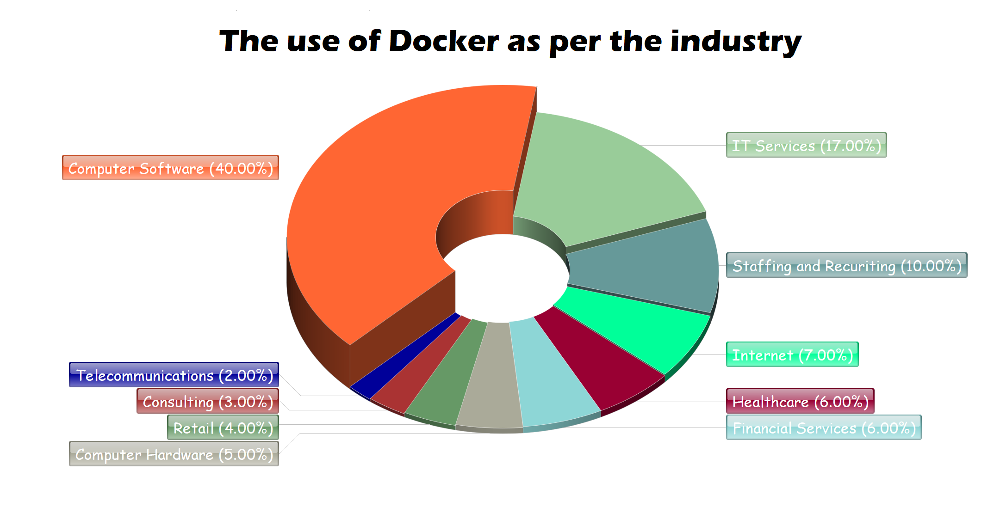

# Docker

## What is Docker?
Docker is a (software) platform that simplifies the process of building, running, managing and distributing applications. It does this by virtualizing the operating system of the computer on which it is installed and running.

## Advantages of using Docker over VMs
- Reduced IT management resources
- Quicker spinning up apps
- Reduced & simplified security updates
- Less code to transfer, migrate, upload workloads

## Who's using Docker?
Major companies that deploy Docker include: Business Insider, Spotify, Yelp, ADP, eBay, The New York Times etc.

Below lies a pie chart showing docker usage per industry from [medium](https://medium.com/@tao_66792/interesting-facts-companies-and-the-use-of-docker-948baa8cf309).

## What is a Microservice architecture?
- A microservices architecture consists of a collection of small, autonomous services. 
- Each service is self-contained and should implement a single business capability within a bounded context, which can be managed by a small development team.
- Services can be deployed independently. A team can update an existing service without rebuilding and redeploying the entire application.

## Advantages of Microservices over Monolith 
- Agility, since microservices are deployed independently, it's easier to manage bug fixes and feature releases. 
- Small, focused teams. A microservice should be small enough that a single feature team can build, test, and deploy it. Large teams tend be less productive, because communication is slower.
- Small code base. Code dependencies in a monolithic application tend to grow entangled over time. Adding a new feature necessitates touching code in several places. A microservices design reduces dependencies by not sharing code or data storage, making it easier to add new features. 

For more advantages, see [here](https://docs.microsoft.com/en-us/azure/architecture/guide/architecture-styles/microservices).

## When to use microservices and monolithic arch.

Monolithic
- Small start up teams may not need the level of microservices complexity. 
- Small/simple applications will not need to be overcomplicated by paritions; and may even induce flexibility within a monolithic architectures.

Microservices
- A complex and scalable application. The microservices architecture will make scaling and adding new capabilities to your application much easier. So if you plan to develop a large application with multiple modules and user journeys, a microservice pattern would be the best way to handle it.
- Multiple teams responsible for multiple services.
- DevOps engineers on hand since building a microservice application is extremely risky.

---

## Remark for Reader
> On bash, type: `alias docker="winpty docker"` if need be.

---
## Commands

- `docker --version` to check version.
- `docker run -d -p 4000:4000 docs/docker.github.io` to get localhost:4000 up and going.
- `docker ps` to check running containers.
- `docker exec -it <container-id> sh` to "ssh" into container. 
- in the shell `vi index.html` to modify localhost:4000
- `docker stop <container-id>` to stop container. 
- `docker info` for info about docker install.
- `docker logs <container-id>` to check logs of container; click [here](https://docs.docker.com/engine/reference/commandline/logs/) for more info. You can save it by `docker logs <container-id> >& file.log`.
- `docker rm <container-id>` to remove a container.
- `docker images` to show images.
- `docker rmi <image-id>` to remove image.
- `docker run -d -p 80:80 nginx`
- `cd usr/share/nginx/html`
-`apt update -y`
-`apt-get install vim` or `apt-get install nano`

---
## Setup own nginx
- `docker run -d -p 80:80 nginx`
- Create your `index.html` on host
- cd to the file
- `docker cp index.html <container-id>:/usr/share/nginx/html/index.html`.
- finished.